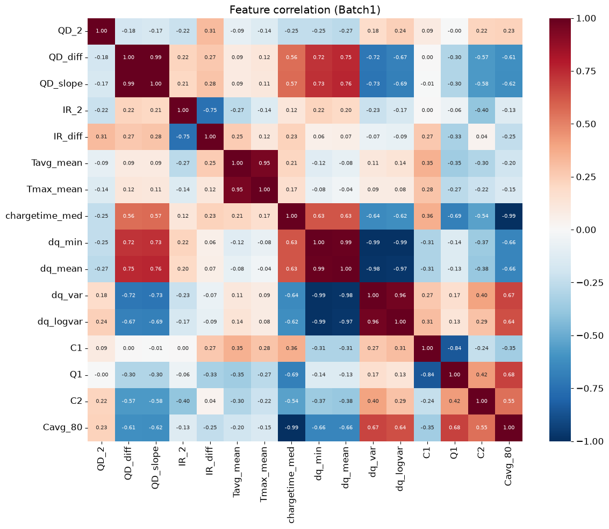

# ESS 배터리 수명 예측

처음 100번의 충방전 기록만으로 배터리의 총 수명(cycle_life)을 예측한다.
배터리 교체 비용은 ESS 설치비의 30~40%를 차지한다. 수명을 미리 알면 교체 시점과 예산을 계획할 수 있다(예지보전).

## 프로젝트 개요
- 데이터셋 : MIT-Stanford Battery Dataset (Severson et al., Nature Energy 2019)
- 학습 데이터 : Batch 1 (2017-05-12)
- 평가 데이터 : Batch 2 (2018-02-20)
- 태스크 : **Regression** (cycle_life 예측)
  - 분류(550 기준 장수명/단수명)를 고르지 않은 이유 : 단수명 배터리가 학습 데이터에 1개, 테스트 데이터에 30개라 학습할 수 없다.

## 파일 구조
```
├── data/                      # GitHub에 올리지 않음 (원본 7.8GB)
│   ├── archive/               # 원본 .mat 파일 (Kaggle에서 다운로드)
│   └── *.pkl                  # 01_EDA가 만드는 정리 파일
├── notebooks/
│   ├── 01_EDA.ipynb           # 데이터 로딩, 품질 점검, EDA Q1~Q5
│   └── 02_modeling.ipynb      # 피처 표, 데이터 분할, 실험, 테스트, 오류 분석
├── results/
│   ├── model_performance.csv  # 성능 표
│   └── feature_correlation_batch1.png  # 피처 상관 히트맵 (Batch 1)
├── requirements.txt
└── README.md
```

## 환경 설정
```bash
git clone https://github.com/horang-ro/ess-battery-project
cd ess-battery-project
python3.11 -m venv .venv
.venv/bin/pip install -r requirements.txt
```
- 원본 .mat 파일 3개(Batch 1·2·3)를 `data/archive/`에 넣고 `01_EDA.ipynb` → `02_modeling.ipynb` 순서로 실행한다.
- 무작위 값은 모두 `random_state = 42`로 고정했다.

## 데이터 정리
- 정답(수명)을 믿을 수 없는 배터리 20개를 뺐다 (139개 → 119개).
  - 수명 값이 없는 10개 : Batch 2 특수 충전 실험 8개, Batch 3에서 실험이 끝날 때까지 수명이 끝나지 않은 2개
  - 수명이 끝나기 전에 실험이 멈춘 10개(Batch 1) : 정상 배터리는 기록된 수명 시점의 용량이 0.876~0.884Ah(수명 끝 기준 0.88Ah)인데, 이 10개는 마지막 용량이 0.915~1.044Ah였다.
- 결과 : 학습 Batch 1 36개, 테스트 Batch 2 39개

## EDA

- **Cycle Life 분포**
  - 배치마다 평균 수명이 다르다 : Batch 1 788 / Batch 2 566 / Batch 3 1,060
  - 핵심 발견 : 테스트(Batch 2)는 72%가 수명 500 미만이지만, 학습(Batch 1)의 최소 수명은 534다.

- **열화 곡선 분석**
  - 모든 배터리가 "천천히 줄다가 → 꺾이는 지점(Knee) → 급격히 떨어짐" 모양이다.
  - Knee는 수명의 약 70% 지점에서 나타나고, 100번째 사이클 이전에 꺾인 배터리는 없다.
  - 핵심 발견 : 처음 100번의 용량 값만으로는 수명이 긴 배터리와 짧은 배터리를 구분할 수 없다.

- **ΔQ(V) 곡선 분석**
  - ΔQ(V) = 100번째 사이클 방전 곡선 − 10번째 사이클 방전 곡선 (전압 3.5V~2.0V, 1,000개 지점)
  - 수명이 짧은 배터리일수록 3.2~2.5V 구간에서 ΔQ가 깊게 파인다.
  - 핵심 발견 : ΔQ 분산(log)과 수명(log)의 상관계수는 −0.90이다(원논문의 핵심 피처를 우리 데이터로 검증). 단, Batch 2는 같은 ΔQ 값에서 수명이 더 짧다.

- **충전 속도(C-rate)와 수명의 관계**
  - Batch 1 안에서는 80%까지 평균 충전 속도가 빠를수록 수명이 짧다(상관계수 −0.58).
  - 핵심 발견 : 세 배치를 합치면 관계가 거의 사라진다(−0.10). Batch 1 안에서만 통하는 신호다.

- **피처 상관관계와 다중공선성**
  - 피처 16개 중 학습 배치와 전체 배치 모두에서 수명과 강하게 관련된 것은 ΔQ 계열뿐이다.
  - 핵심 발견 : 서로 비슷한 피처가 많다(ΔQ 4종끼리 0.96~0.99). 묶음마다 1개만 쓴다.

  

> 정정 : DAY 1 보고서 Q5의 "전체 배치" 상관계수는, 내부 저항(IR)이 측정되지 않은 Batch 2 배터리 6개가 빠진 113개 기준이었다. 119개로 다시 계산해도 차이는 최대 0.05이며 결론은 같다. DAY 2에서는 이 6개를 포함했다(IR 피처는 쓰지 않으므로 영향 없음).

## Modeling

### 피처 엔지니어링 전략
- 핵심 피처 : **ΔQ 분산(log)** (`dq_logvar`) — 배치가 바뀌어도 수명과의 관계가 유지되는 유일한 피처
- 보조 피처 후보 3개(용량 감소 기울기, 80%까지 평균 충전 속도, 평균 온도)를 하나씩 추가해 보고, 교차검증(CV) MAPE가 좋아질 때만 채택하기로 했다.
- 결과 : 3개 모두 CV MAPE가 나빠져(10.5% → 11.0~13.5%) 채택하지 않았다. EDA에서 "Batch 1에서만 통하는 신호"라고 판단한 것과 일치한다.

### 데이터 분할
- Train : Batch 1 중 27개 / Valid : Batch 1 중 9개 / Test : Batch 2 39개 (마지막에 1번만 평가)
- Valid 9개는 수명을 3구간으로 나눠 구간마다 3개씩 뽑았다(층화 추출). 검증 데이터에 짧은·중간·긴 배터리가 골고루 들어가야 검증 점수를 믿을 수 있기 때문이다.
- Train CV는 같은 충전 방식의 배터리를 같은 묶음에 넣었다(GroupKFold). 같은 방식의 배터리가 학습과 검증에 나뉘어 들어가면 점수가 실제보다 좋게 나오기 때문이다.
- 표준화는 학습 데이터로만 기준을 정하고, 검증·테스트에는 그 기준을 적용만 했다.

### 실험 이력
| 실험 | 피처 | Train CV MAPE | Valid MAPE |
|---|---|---|---|
| **E1 선형 회귀 (기준선)** | **dq_logvar** | **10.5** | **7.1** |
| E2 + 용량 감소 기울기 | dq_logvar, QD_slope | 13.5 | 6.9 |
| E2 + 80%까지 평균 충전 속도 | dq_logvar, Cavg_80 | 11.0 | 7.8 |
| E2 + 평균 온도 | dq_logvar, Tavg_mean | 11.0 | 7.1 |
| E3 Ridge | 피처 4개 | 12.5 | 9.0 |
| E4 Lasso | 피처 4개 | 11.6 | 8.1 |
| E5 RandomForest | 피처 4개 | 13.2 | 7.2 |

- 피처 추가 여부는 Valid(9개)가 아니라 Train CV(27개) 기준으로 판단했다. Valid는 배터리가 적어 1~2개 결과에 크게 흔들리기 때문이다.
- Lasso는 dq_logvar를 중심으로 쓰고, 나머지 피처의 계수는 0이거나 매우 작게 만들었다. 피처를 줄이는 것이 낫다는 결론과 같다.

### 모델 선택 및 근거
- 후보 모델 : 선형 회귀, Ridge, Lasso, RandomForest
- 최종 모델 : **선형 회귀 (dq_logvar 1개, 타깃 log10 수명)**
- 선택 이유
  - Train CV MAPE가 가장 좋다(10.5%).
  - 가장 단순해서 학습 데이터 36개에 과적합될 위험이 가장 작다.
  - 선형 모델은 학습 범위 밖의 수명도 예측할 수 있다. 트리 모델은 학습 최대 수명(1,074)을 넘는 값을 낼 수 없다.
- 최종 모델은 Batch 1 전체(36개)로 다시 학습한 뒤 Batch 2를 한 번만 예측했다.

## 성능 결과
| 구분 | MAPE (%) | 비고 |
|---|---|---|
| Train (Batch 1 CV) | 10.5 | |
| Valid (Batch 1 Hold-out) | 7.1 | |
| Test (Batch 2) | 28.6 | |
| Gap (Train-Valid) | −3.4 | (+) 과적합 의심 → 해당 없음 |
| Gap (Valid-Test) | +21.5 | (+) 배치 간 일반화 저하 의심 → 해당 |
| Gap (Target-Test) | +19.5 | Target : 원논문 9.1% |

- 보조 지표 (Test) : RMSE 163 사이클, R² 0.45
- Gap (Train–Valid) = Valid − Train으로 계산했다. MAPE는 낮을수록 좋으므로, 이렇게 빼야 (+)가 "과적합"을 뜻한다.

**해석**
- **과적합은 없다.** Valid가 Train보다 오히려 좋다. 다만 Valid 9개 중 4개는 충전 방식이 같은 짝 배터리가 학습 데이터에 있어 상대적으로 쉬웠다. 실력은 Train CV 10.5%가 더 현실적이다.
- **배치가 바뀌자 성능이 크게 떨어졌다.** 같은 배치(Batch 1)에서는 7~10%지만, 처음 보는 배치(Batch 2)에서는 28.6%다.
- **오차는 거의 전부 한 방향이다.** Test MAPE 28.6%와 평균 오차 방향 +28.1%가 거의 같다. 39개 중 38개를 실제보다 길게 예측했다. 모델이 무작위로 틀린 것이 아니라, 배치 차이 때문에 일정하게 밀려 있다.
- **EDA에서 예상한 결과다.** DAY 1 보고서(Q3)에서 "같은 ΔQ 분산에서 Batch 2 수명이 더 짧아, 테스트에서 길게 예측할 위험이 있다"고 기록했고, 그대로 나타났다.

## 오류 분석
- **크게 틀린 배터리의 공통점** : 수명이 짧은 배터리다.

  | 수명 구간 | 배터리 수 | 평균 오차 |
  |---|---|---|
  | 500 미만 | 28 | +31.9% |
  | 500~800 | 4 | +35.2% |
  | 800 이상 | 7 | +9.1% |

  오차가 가장 큰 5개 중 4개가 수명 393~449인 배터리다(예 : 실제 393 → 예측 648).
- **원인 가설** : 학습 데이터(Batch 1)의 최소 수명은 534로, 400대 배터리를 학습한 적이 없다. Batch 2의 짧은 배터리는 같은 ΔQ 값을 가진 Batch 1 배터리보다 훨씬 빨리 수명이 끝난다. 그래서 Batch 1로 배운 관계로는 길게 예측된다.
- **확인 후 기각한 가설** : Batch 2에만 있는 "2단계가 더 빠른 충전 방식"(예 : 3.6C(9%)-5C)이 원인인지 확인했다. 해당 8개와 나머지 31개의 평균 오차가 비슷해(+29.4% vs +27.8%) 원인이 아니었다.
- **개선 방향**
  - 짧은 수명 배터리가 포함되도록 여러 배치의 데이터를 함께 학습한다.
  - 배치 간 차이를 설명할 수 있는 피처를 찾는다(예 : 배치마다 다른 초기 상태를 보정하는 값).
  - 테스트 결과를 본 뒤 모델을 고치면 평가가 오염되므로, 위 개선은 새 검증 설계에서 진행해야 한다.

## ESS 도메인 해석
- **활용 가능한 의사결정**
  - 수명이 긴 배터리(800 이상)는 오차 9.1% 수준으로 예측돼, 교체 시점과 예산을 대략 계획하는 용도로 쓸 수 있다.
  - 반대로 수명이 짧은 배터리는 실제보다 길게 예측된다. 이대로 쓰면 교체가 늦어져 갑작스러운 설비 중단 위험이 있다. 현재 모델은 "불량 배터리 조기 선별"에는 쓰기 어렵다.
- **한계**
  - 학습 데이터가 36개로 적고, 한 배치(한 시기의 실험)만으로 학습했다.
  - 생산 시기(배치)가 바뀌면 같은 ΔQ 값에서도 수명이 달라질 수 있다.
- **실제 배포에 필요한 것**
  - 여러 생산 배치의 데이터로 학습하고, 새 배치가 들어올 때마다 성능을 점검한다.
  - 예측이 실제보다 길게 나오는 경향을 감시하고(데이터 드리프트), 정해진 주기나 성능 하락 시 다시 학습한다.
  - 예측값 하나보다 "수명 범위"를 함께 제시해, 운영자가 보수적으로 교체 시점을 잡을 수 있게 한다.

## 참고문헌
- Severson, K. A. et al. (2019). Data-driven prediction of battery cycle life before capacity degradation. *Nature Energy*, 4, 383–391.

## 팀 구성
- 김해린 (1인) : EDA, 피처 엔지니어링, 모델 개발, 성능 평가(Batch 2)
